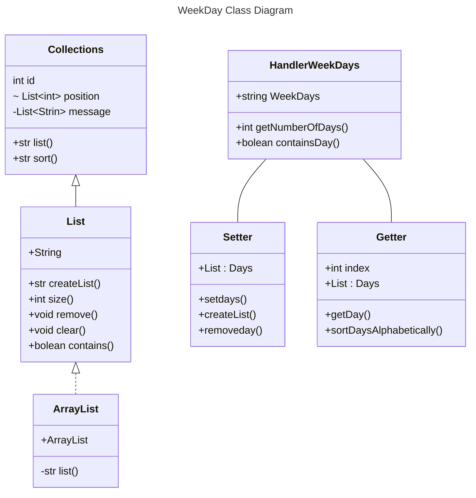

```mermaid
---
title: WeekDay Class Diagram
---
classDiagram
    Collections <|-- List
    List <|.. ArrayList
    Collections
     HandlerWeekDays -- Setter
     HandlerWeekDays -- Getter
    Collections: int id
    Collections: ~ List~int~ position
    Collections: -List~Strin~ message
    Collections: +str list()
    Collections: +str sort()
    List : +String 
    List : +str createList() 
    List : +int size()
    List : +void remove()
    List : +void clear()
    List : +bolean contains()
    ArrayList : +ArrayList
    ArrayList : -str list()

    class HandlerWeekDays{
      +string WeekDays
      +int getNumberOfDays()
      +bolean containsDay() 
    }
    class Setter{
        +List<String> : Days
        +setdays()
        +createList()
        +removeday()
      }
    class Getter{
        +int index
        +List<String> : Days
        +getDay()
        +sortDaysAlphabetically()
    }

```
